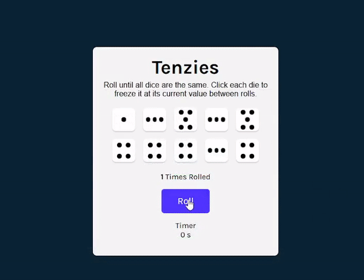

# Tenzies Game

## Description

Tenzies is a fun and engaging dice game where the objective is to roll and collect all ten dice to show the same number. Players can freeze individual dice between rolls, adding a strategic element to the game.  This implementation provides an interactive experience with real-time updates and visual feedback.

## How to Play

1.**Start the Game**: Click the "Roll" button to begin.
2.**Roll the Dice**: Click the "Roll" button to roll the dice. Each die will display a random number between 1 and 6.
3.**Hold Dice**: Click on any die to freeze it at its current value. Held dice will not change when you roll again.
4.**Continue Rolling**: Keep rolling the remaining dice until all dice show the same number.
5.**Win the Game**: Once all ten dice are held with the same value, confetti will fall, signaling your victory!
6.**New Game**: Click the "New Game" button to start over.

## Screenshots

## What I Learned

By exploring the Tenzies app, you can learn:

- **Random Value Generation**: Learn how to generate random numbers and manage game state based on user interaction.
- **Timers and Intervals**: Implement timers to track game duration and manage intervals effectively.

## Features

- **Interactive Gameplay**: Roll the dice and click to hold individual dice.
- **Win Condition**: The game detects when all dice are held with the same value and displays a confetti animation.
- **Roll Counter**: Keep track of how many times the dice have been rolled.
- **Timer**: A simple timer to track how long the game takes.
- **Reset Functionality**: Start a new game easily once the objective is achieved.

## Technologies Used

* **HTML**
* **CSSReact: A JavaScript library for building user interfaces.**
* ****Nanoid**: A tiny, secure URL-friendly unique ID generator for JavaScript.**
* ****React Confetti**: A package to add confetti animations to celebrate the win.**

## Links

- [Live Dem](https://tenzies-game-nu-kohl.vercel.app/)
